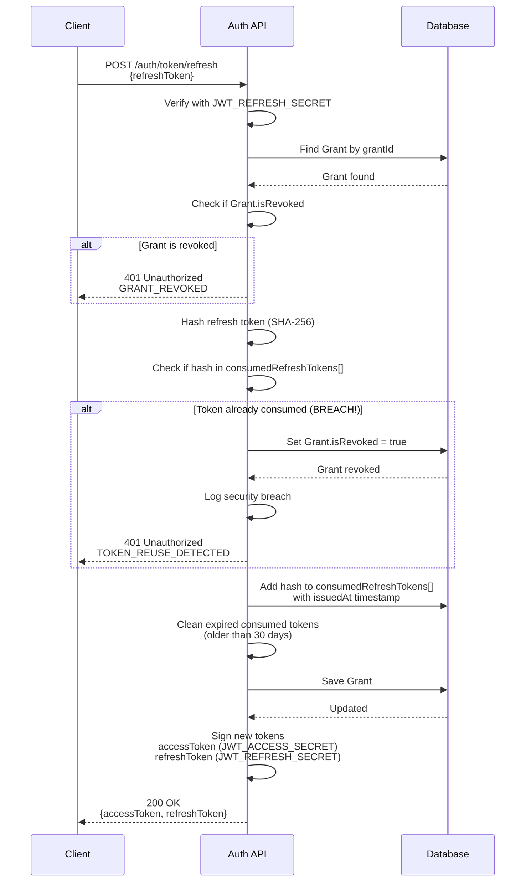
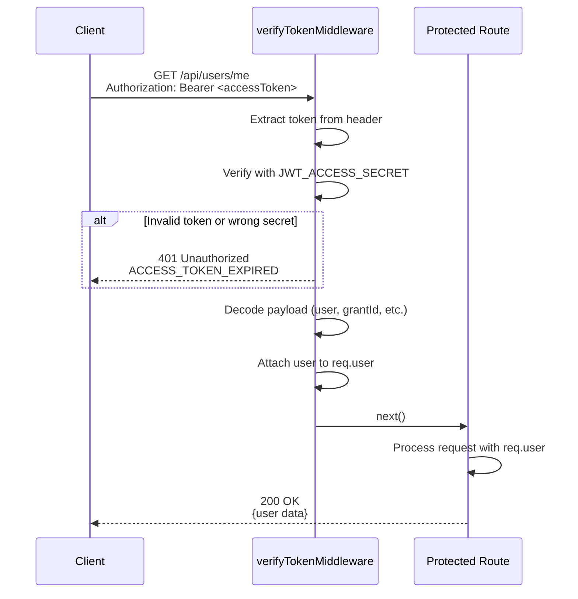
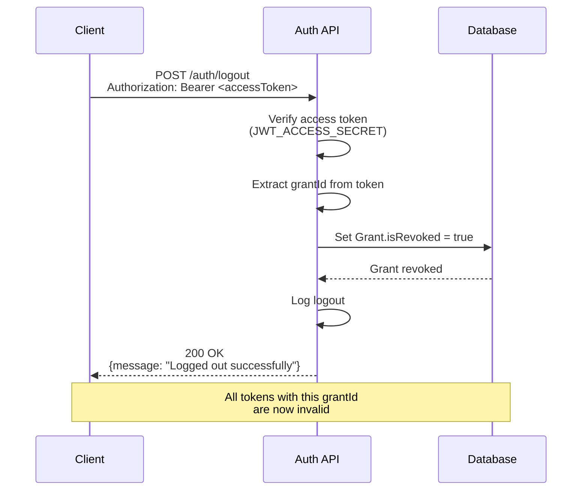
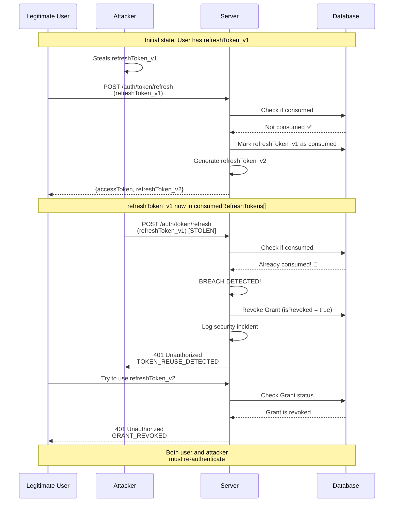
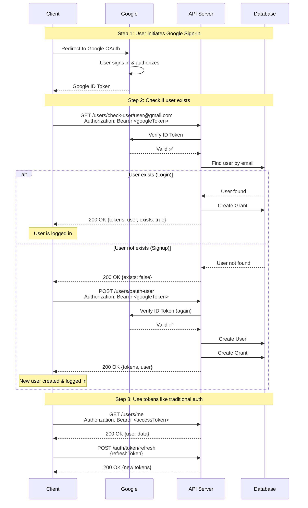

# Authentication Documentation

Complete guide to the authentication system with JWT-based access control, grant management, and token rotation security.

---

## Table of Contents

- [Overview](#overview)
- [Architecture](#architecture)
- [Token Types](#token-types)
- [Security Features](#security-features)
- [Authentication Flow](#authentication-flow)
- [OAuth 2.0 Flow (Google)](#oauth-20-flow-google)
- [API Endpoints](#api-endpoints)
- [Error Codes](#error-codes)

---

## Overview

This authentication system implements a **grant-based JWT architecture** with:
- ✅ **Cryptographic token separation** - Different secrets for access and refresh tokens
- ✅ **Token rotation** - Refresh tokens are single-use only
- ✅ **Breach detection** - Automatic detection and revocation on token reuse
- ✅ **Session management** - Grant-based sessions with revocation support
- ✅ **Auto cleanup** - MongoDB TTL indexes for automatic grant expiration
- ✅ **OAuth 2.0 support** - Google Sign-In integration with same security features

---

## Architecture

### Components

```
┌─────────────────────────────────────────────────────────────┐
│                     Authentication System                    │
├─────────────────────────────────────────────────────────────┤
│                                                               │
│  User Model                                                   │
│  ├─ email, password (hashed)                                 │
│  ├─ username, name, role                                     │
│  └─ authentication: { salt, password }                       │
│                                                               │
│  Grant Model (Session)                                       │
│  ├─ userId (ref to User)                                     │
│  ├─ consumedRefreshTokens: [ { hash, issuedAt } ]           │
│  ├─ isRevoked (boolean)                                      │
│  ├─ createdAt, updatedAt                                     │
│  └─ TTL index (auto-cleanup after 30 days)                  │
│                                                               │
│  JWT Tokens                                                   │
│  ├─ Access Token (JWT_ACCESS_SECRET, 1 hour)                │
│  └─ Refresh Token (JWT_REFRESH_SECRET, 30 days)             │
│                                                               │
└─────────────────────────────────────────────────────────────┘
```

### Token Payload Structure

```typescript
interface IJwtUserPayload {
  id: string; // User ID
  email: string; // User email
  role: string; // USER | ADMIN
  grantId: string; // Grant/Session ID
  iat: number; // Issued at (Unix timestamp)
  exp: number; // Expires at (Unix timestamp)
}
```

---

## Token Types

### Access Token
- **Purpose**: Short-lived token for API access
- **Secret**: `JWT_ACCESS_SECRET`
- **Lifetime**: 1 hour (3600 seconds)
- **Usage**: Include in `Authorization: Bearer <token>` header
- **Verification**: Protected routes verify with `JWT_ACCESS_SECRET`
- **Cannot be used**: On refresh endpoint (cryptographically rejected)

### Refresh Token
- **Purpose**: Long-lived token for obtaining new access tokens
- **Secret**: `JWT_REFRESH_SECRET`
- **Lifetime**: 30 days (2592000 seconds)
- **Usage**: Send in request body to `/auth/token/refresh`
- **Single-use**: Consumed after each use (rotation)
- **Cannot be used**: On protected routes (cryptographically rejected)

### Cryptographic Separation

```typescript
// Access token signed with JWT_ACCESS_SECRET
const accessToken = jwt.sign(payload, JWT_ACCESS_SECRET);

// Refresh token signed with JWT_REFRESH_SECRET
const refreshToken = jwt.sign(payload, JWT_REFRESH_SECRET);

// Middleware only accepts access tokens
jwt.verify(token, JWT_ACCESS_SECRET); // ✅ Access tokens pass
// ❌ Refresh tokens fail

// Refresh endpoint only accepts refresh tokens
jwt.verify(token, JWT_REFRESH_SECRET); // ✅ Refresh tokens pass
// ❌ Access tokens fail
```

---

## Security Features

### 1. Different Secrets for Token Types 🔐

**Implementation**: Access and refresh tokens use different signing secrets.

**Benefit**: Cryptographically enforces token type separation. A stolen refresh token cannot be used on protected APIs.

**Attack Prevention**:
```
❌ Attacker steals refresh token → Tries on /api/users/me
   → JWT verification fails (wrong secret)
   → 401 Unauthorized
```

### 2. Token Rotation 🔄

**Implementation**: Each refresh token can only be used once. After use, it's marked as consumed and a new one is issued.

**Benefit**: Limits the window of opportunity for attackers.

**Flow**:
```
1. User has refreshToken_v1
2. User calls /auth/token/refresh with refreshToken_v1
3. Server:
   - Validates refreshToken_v1
   - Marks refreshToken_v1 as consumed
   - Issues refreshToken_v2 and new access token
4. User must use refreshToken_v2 for next refresh
```

### 3. Breach Detection 🚨

**Implementation**: If a consumed (old) refresh token is reused, the system detects this as a security breach.

**Benefit**: Automatically protects users when tokens are stolen.

**Flow**:
```
1. Attacker steals refreshToken_v1
2. Legitimate user uses refreshToken_v1 → gets refreshToken_v2 (v1 consumed)
3. Attacker tries to use refreshToken_v1
4. Server detects reuse:
   - Revokes entire grant (all tokens invalid)
   - Returns error: TOKEN_REUSE_DETECTED
   - Logs security breach
5. Both user and attacker must re-authenticate
```

### 4. Grant-Based Sessions 📝

**Implementation**: Each login creates a Grant record. All tokens for that session contain the grantId.

**Benefit**: Enables session management and instant revocation.

**Features**:
- One grant per login session
- Multiple active grants per user (multi-device support)
- Revoke single session with `/logout`
- Auto-cleanup after 30 days of inactivity

### 5. Consumed Token Tracking with Expiry ⏰

**Implementation**: Consumed refresh tokens are stored with their issuance timestamp and automatically cleaned up.

**Benefit**: Maintains security history without bloating the database.

**Logic**:
```typescript
// Store consumed token with issuance time from JWT
grant.consumedRefreshTokens.push({
  hash: sha256(token),
  issuedAt: new Date(decoded.iat * 1000)
});

// Remove tokens older than 30 days (based on issuance)
const cutoffDate = new Date(Date.now() - 30 * 24 * 60 * 60 * 1000);
grant.consumedRefreshTokens = grant.consumedRefreshTokens.filter(
  token => token.issuedAt > cutoffDate
);
```

---

## Authentication Flow

### Token Refresh Flow



### Protected Route Access Flow



### Logout Flow (Single Session)



### Security Breach Detection Flow



---

## OAuth 2.0 Flow (Google)

The system supports Google Sign-In using OAuth 2.0, providing the same security features as traditional authentication (grant-based sessions, token rotation, breach detection).

### OAuth Architecture

```
┌─────────────────────────────────────────────────────────────┐
│                     OAuth 2.0 Flow                           │
├─────────────────────────────────────────────────────────────┤
│                                                               │
│  1. Client → Google OAuth                                    │
│     - User signs in with Google                              │
│     - Receives Google ID Token                               │
│                                                               │
│  2. Client → Your API (with Google ID Token)                 │
│     - verifyTokenGoogleProvider middleware                   │
│     - Validates token with Google                            │
│     - Extracts user data (email, picture, etc.)             │
│                                                               │
│  3. Check User Existence (Login)                             │
│     GET /users/check-user/:email                            │
│     - If user exists → Create Grant → Return tokens         │
│     - If not exists → Return { exists: false }              │
│                                                               │
│  4. Create OAuth User (Signup)                               │
│     POST /users/oauth-user                                  │
│     - Create new user                                        │
│     - Download & save Google profile picture                │
│     - Create Grant → Return tokens                          │
│                                                               │
│  Result: User gets same JWT tokens as traditional auth      │
│  (Access Token + Refresh Token with Grant)                  │
│                                                               │
└─────────────────────────────────────────────────────────────┘
```

### OAuth Complete Authentication Flow



### OAuth API Endpoints

Base URL: `http://localhost:4000/api/v1`

#### 1. Check User Existence (OAuth Login)

Verifies Google token and logs in if user exists.

**Endpoint**: `GET /users/check-user/:email`

**Headers**: Google ID Token required

**Request**:
```bash
curl -X GET http://localhost:4000/api/v1/users/check-user/user@gmail.com \
  -H "Authorization: Bearer <GOOGLE_ID_TOKEN>"
```

**Response (User exists - Login successful)** (200 OK):
```json
{
  "success": true,
  "data": {
    "tokens": {
      "accessToken": "eyJhbGciOiJIUzI1NiIsInR5cCI6IkpXVCJ9...",
      "refreshToken": "eyJhbGciOiJIUzI1NiIsInR5cCI6IkpXVCJ9..."
    },
    "user": {
      "id": "67d2aa72b3dd2cfb37b7104f",
      "email": "user@gmail.com",
      "username": "user_abc123",
      "name": "user",
      "role": "USER",
      "profilePictureUrl": "/uploads/users/67d2aa72.../profile.jpg"
    },
    "exists": true
  }
}
```

**Response (User doesn't exist - Need signup)** (200 OK):
```json
{
  "success": true,
  "data": {
    "exists": false
  }
}
```

**Error Response (Invalid Google Token)** (401 Unauthorized):
```json
{
  "success": false,
  "message": "No token provided."
}
```

---

#### 2. Save OAuth User (OAuth Signup)

Creates a new user from Google authentication.

**Endpoint**: `POST /users/oauth-user`

**Headers**: Google ID Token required

**Request**:
```bash
curl -X POST http://localhost:4000/api/v1/users/oauth-user \
  -H "Authorization: Bearer <GOOGLE_ID_TOKEN>"
```

**Response (User created)** (200 OK):
```json
{
  "success": true,
  "data": {
    "tokens": {
      "accessToken": "eyJhbGciOiJIUzI1NiIsInR5cCI6IkpXVCJ9...",
      "refreshToken": "eyJhbGciOiJIUzI1NiIsInR5cCI6IkpXVCJ9..."
    },
    "user": {
      "id": "67d2aa72b3dd2cfb37b7104f",
      "email": "newuser@gmail.com",
      "username": "newuser_xyz789",
      "name": "newuser",
      "role": "USER",
      "profilePictureUrl": "/uploads/users/67d2aa72.../profile.jpg"
    }
  }
}
```

**Error Response (User already exists)** (400 Bad Request):
```json
{
  "success": false,
  "message": "User already exits"
}
```

**Error Response (Invalid Google Token)** (401 Unauthorized):
```json
{
  "success": false,
  "message": "No token provided."
}
```

### Google ID Token Structure

When Google OAuth succeeds, you receive an ID Token (JWT) with this payload:

```json
{
  "iss": "https://accounts.google.com",
  "azp": "YOUR_GOOGLE_CLIENT_ID",
  "aud": "YOUR_GOOGLE_CLIENT_ID",
  "sub": "1234567890",
  "email": "user@gmail.com",
  "email_verified": true,
  "name": "John Doe",
  "picture": "https://lh3.googleusercontent.com/.../photo.jpg",
  "given_name": "John",
  "family_name": "Doe",
  "iat": 1716239022,
  "exp": 1716242622
}
```

## Summary

This authentication system provides:

✅ **Security**: Cryptographic token separation, rotation, and breach detection
✅ **Scalability**: Grant-based sessions with automatic cleanup
✅ **User Experience**: Long refresh token lifetime with automatic renewal
✅ **Multi-device**: Multiple concurrent sessions per user
✅ **Control**: Logout single session or all sessions
✅ **Monitoring**: Detailed logging of security events

**Key Takeaways**:
- Access tokens for API access (1 hour, JWT_ACCESS_SECRET)
- Refresh tokens for obtaining new access tokens (30 days, JWT_REFRESH_SECRET)
- Different secrets = cryptographic separation
- Token rotation = single-use refresh tokens
- Breach detection = automatic revocation on reuse
- Grant-based = proper session management

For questions or issues, refer to the troubleshooting section or check server logs.
