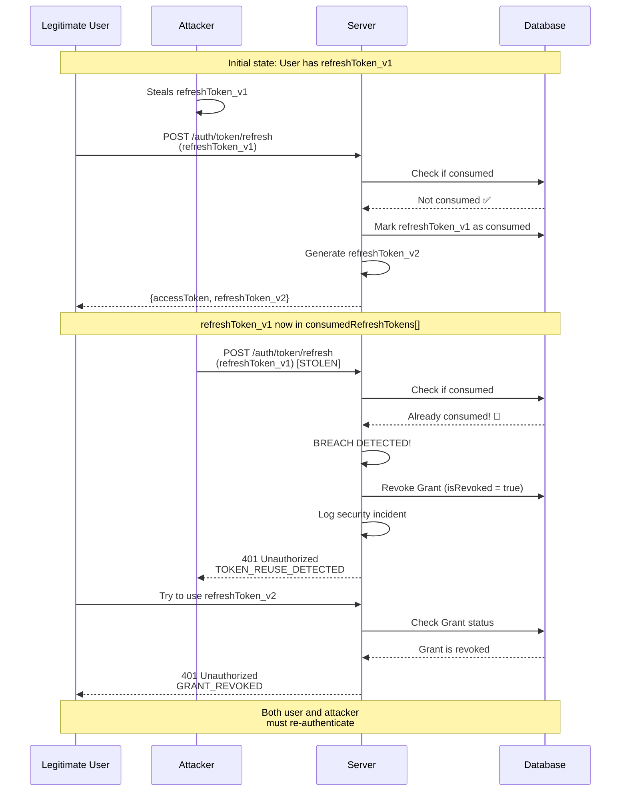
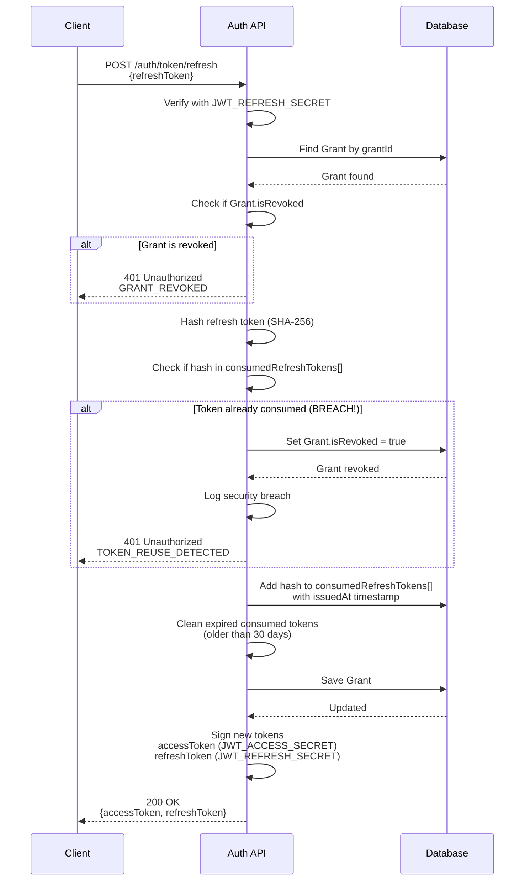
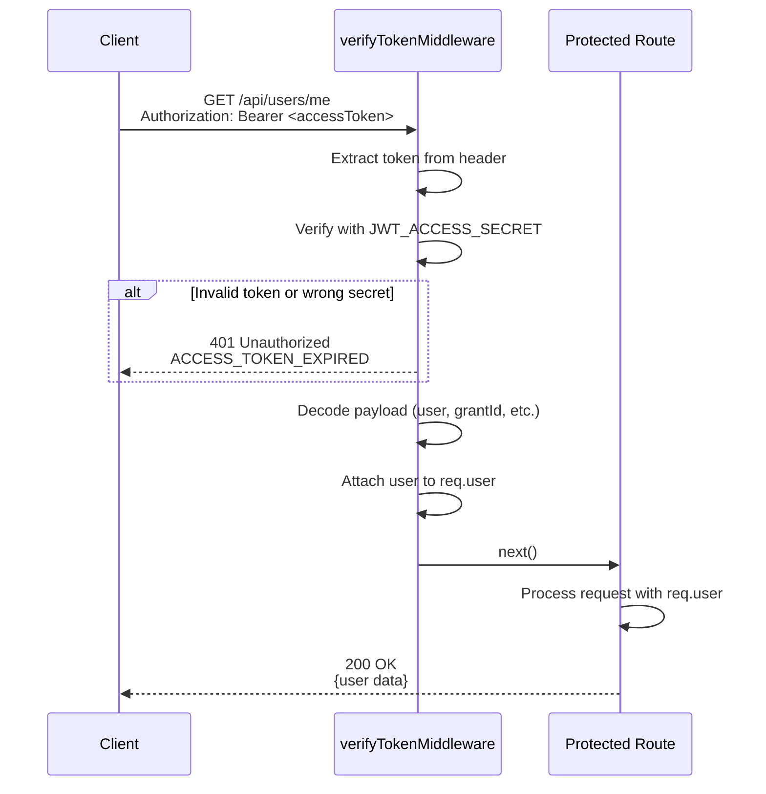
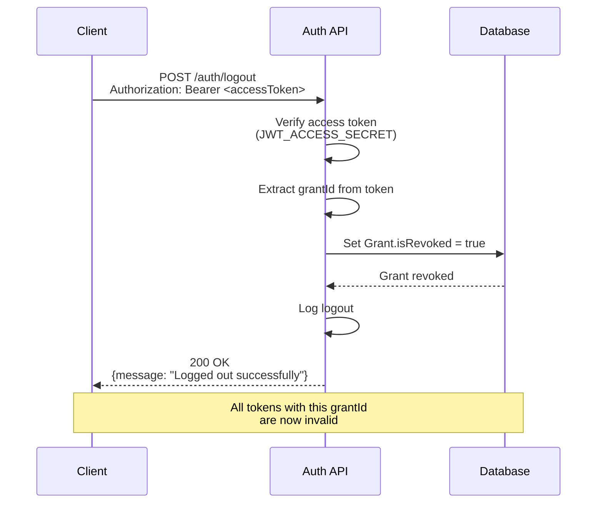
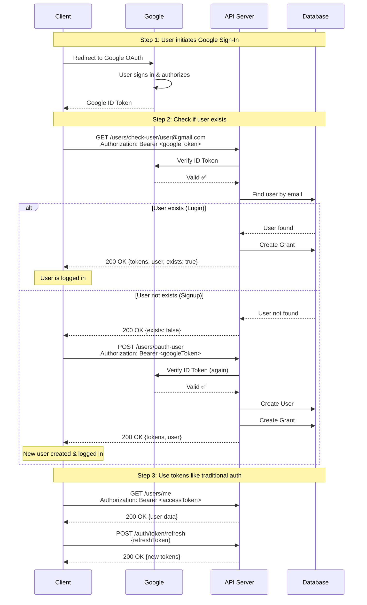

# Securing JWT Authentication with Token Rotation: A Practical Implementation

Token-based authentication has become the de facto standard for modern web applications, offering a stateless and scalable approach to user session management. However, with the convenience of long-lived refresh tokens comes significant security risks. In this post, we'll explore how **token rotation** addresses these vulnerabilities and walk through a real-world implementation using Node.js, Express, and MongoDB.

---

## Table of Contents

1. [Introduction to Token-Based Authentication](#introduction-to-token-based-authentication)
2. [Benefits of the Two-Token System](#benefits-of-the-two-token-system)
3. [The Security Problem: Stolen Refresh Tokens](#the-security-problem-stolen-refresh-tokens)
4. [The Solution: Token Rotation](#the-solution-token-rotation)
5. [Implementation Details](#implementation-details)
6. [Trade-offs and Optimizations](#trade-offs-and-optimizations)
7. [Conclusion](#conclusion)

---

## Introduction to Token-Based Authentication

Token-based authentication uses cryptographically signed tokens (typically JWTs) to verify user identity without requiring server-side session storage. The standard approach uses **two types of tokens**:

### Access Token
- **Purpose**: Short-lived credential for API access
- **Lifetime**: Typically 15 minutes to 1 hour
- **Usage**: Sent with every API request in the `Authorization` header
- **Security**: Limited damage if stolen due to short expiration

### Refresh Token
- **Purpose**: Long-lived credential to obtain new access tokens
- **Lifetime**: Typically 7-30 days or longer
- **Usage**: Only sent to the token refresh endpoint
- **Security**: High-value target for attackers

```typescript
// Token payload structure
interface IJwtUserPayload {
  id: string; // User ID
  email: string; // User email
  role: string; // USER | ADMIN
  grantId: string; // Session/Grant ID (for revocation)
  iat: number; // Issued at (Unix timestamp)
  exp: number; // Expires at (Unix timestamp)
}
```

### Cryptographic Separation

A critical security feature is using **different secrets** for each token type:

```typescript
// Access token signed with JWT_ACCESS_SECRET
const accessToken = jwt.sign(payload, JWT_ACCESS_SECRET, { expiresIn: '1h' });

// Refresh token signed with JWT_REFRESH_SECRET
const refreshToken = jwt.sign(payload, JWT_REFRESH_SECRET, { expiresIn: '30d' });
```

This ensures that:
- A stolen refresh token **cannot** be used on protected API routes (cryptographically rejected)
- A stolen access token **cannot** be used to obtain new tokens (cryptographically rejected)

---

## Benefits of the Two-Token System

### 1. **Enhanced Security**
By keeping access tokens short-lived, we minimize the attack window. Even if an access token is compromised, it becomes useless within an hour.

### 2. **Improved User Experience**
Users don't need to re-authenticate frequently. The refresh token silently obtains new access tokens in the background, providing a seamless experience.

### 3. **Scalability**
Tokens are stateless and self-contained, eliminating the need for server-side session storage (Redis, Memcached) in most cases. This simplifies horizontal scaling.

### 4. **Granular Access Control**
Different token types can have different permissions. Access tokens can contain fine-grained permissions, while refresh tokens only have permission to... refresh tokens.

### 5. **Reduced Server Load**
Token verification is computationally cheap (signature validation) compared to database lookups for every request.

---

## The Security Problem: Stolen Refresh Tokens

While the two-token system is powerful, **refresh tokens are a high-value target** for attackers. Here's why:

### Real-World Example: Banking App Vulnerability

Imagine a mobile banking application that uses traditional (non-rotating) refresh tokens:

**The Setup:**
- **BankApp Mobile** uses JWT authentication
- Access token expires in 15 minutes
- Refresh token expires in 30 days
- User checks balance daily but stays logged in

**The Attack:**

```
Day 1: Sarah installs malware disguised as a "Battery Optimizer" app
       → Malware extracts tokens from BankApp's storage
       → Attacker now has Sarah's refresh token

Day 2-30: Attacker's automated script:
       → Uses stolen refresh token every 14 minutes
       → Gets new access tokens continuously
       → Performs reconnaissance: checks balances, transaction history
       → Drains account slowly ($200/day to avoid detection)

Day 5: Sarah notices unauthorized transactions
       → Changes password (doesn't help - refresh token still valid!)
       → Calls bank support
       → Support must manually revoke ALL sessions

Day 6: Sarah's entire savings account is empty ($6,000 stolen)
       → Bank's fraud detection never triggered (legitimate tokens used)
       → Insurance claim takes 90 days to process
```

**Why This Happens:**

The stolen refresh token is **cryptographically valid** for 30 days. Even changing the password doesn't invalidate it because:
- Tokens are self-contained (stateless)
- No server-side validation of token freshness
- No mechanism to detect token reuse

**Financial Impact:**
- Average loss per incident: $5,000-$50,000
- Bank reputation damage: Immeasurable
- Regulatory fines (PCI-DSS violation): Up to $500,000
- Customer churn rate: 40% after security breach

### Generic Attack Scenario

```
1. Attacker steals a refresh token via:
   ❌ XSS attack extracting localStorage
   ❌ Man-in-the-middle attack
   ❌ Compromised client device
   ❌ Malware (keylogger, screen recorder)
   ❌ Physical access to unlocked device
   ❌ Phishing (fake login page)

2. Attacker uses the stolen refresh token to obtain:
   ✅ New access token (valid for 1 hour)
   ✅ New refresh token (valid for 30 days)

3. Attacker repeats step 2 indefinitely
   → Permanent account access for 30 days
   → Legitimate user remains logged in (no alerts)
   → No detection mechanism
   → Password changes don't help
```

### The Core Problem

**Traditional refresh tokens are reusable.** An attacker can use a stolen token multiple times to maintain persistent access, even after the legitimate user has obtained new tokens.

```typescript
// ❌ VULNERABLE: Traditional approach
async function refreshAccessToken(req, res) {
  const { refreshToken } = req.body;

  // Verify token
  const decoded = jwt.verify(refreshToken, JWT_REFRESH_SECRET);

  // Generate new access token
  const accessToken = jwt.sign(payload, JWT_ACCESS_SECRET, { expiresIn: '1h' });

  // ⚠️ PROBLEM: Old refresh token is still valid!
  return res.json({ accessToken, refreshToken }); // Same refresh token returned
}
```

The legitimate user and attacker can both use the same refresh token indefinitely until it expires naturally.

---

## The Solution: Token Rotation

**Token rotation** makes refresh tokens **single-use**. Each time a refresh token is used, it's marked as "consumed" and a new one is issued.

### Core Principles

1. **One-Time Use**: A refresh token can only be used once
2. **Automatic Rotation**: Every refresh generates a new refresh token
3. **Breach Detection**: Reusing a consumed token triggers an alert and revokes the session
4. **Grant-Based Sessions**: Each login creates a "Grant" (session) that tracks consumed tokens

### How It Works

```
┌──────────────────────────────────────────────────────────────┐
│                    Token Rotation Flow                        │
├──────────────────────────────────────────────────────────────┤
│                                                               │
│  1. User has refreshToken_v1                                 │
│                                                               │
│  2. POST /auth/token/refresh (refreshToken_v1)               │
│     → Server validates token                                 │
│     → Server marks refreshToken_v1 as "consumed"            │
│     → Server issues refreshToken_v2 + new accessToken       │
│                                                               │
│  3. User must use refreshToken_v2 for next refresh          │
│                                                               │
│  4. If refreshToken_v1 is reused (BREACH!)                  │
│     → Server detects reuse                                   │
│     → Server revokes entire grant                            │
│     → Both user and attacker must re-authenticate           │
│                                                               │
└──────────────────────────────────────────────────────────────┘
```

### Breach Detection in Action

```
Timeline:

T=0:  User has refreshToken_v1

T=1:  Attacker steals refreshToken_v1

T=2:  Legitimate user uses refreshToken_v1
      → Gets refreshToken_v2
      → refreshToken_v1 marked as consumed ✅

T=3:  Attacker tries to use refreshToken_v1
      → Server detects: "This token was already used!" 🚨
      → Server revokes entire session
      → Legitimate user receives 401 on next request
      → User must re-authenticate (minor inconvenience)
      → Attacker is locked out ✅
```

### Security Breach Detection Flow Diagram



**Banking App with Token Rotation:**

Now let's see how the same attack plays out with token rotation implemented:

```
Day 1: Sarah installs malware, attacker steals refreshToken_v1

Day 2, 8:00 AM: Sarah opens BankApp (legitimate use)
       → App automatically refreshes using refreshToken_v1
       → Gets refreshToken_v2 (v1 marked as consumed)

Day 2, 8:05 AM: Attacker's script tries to use stolen refreshToken_v1
       → 🚨 BREACH DETECTED (token already consumed)
       → Server revokes entire grant immediately
       → Logs security incident with timestamp
       → Sends alert email to Sarah: "Suspicious activity detected"

Day 2, 8:10 AM: Sarah sees the alert and tries to check balance
       → Session invalid, must re-authenticate
       → Re-logs in with password (takes 10 seconds)
       → New grant created with fresh tokens

Day 2, 8:15 AM: Attacker permanently locked out
       → All stolen tokens are now invalid
       → Cannot access account anymore
       → Attack contained within 5 minutes

Result: $0 stolen, account secure, minor inconvenience for Sarah
```

**Impact Comparison:**

| Aspect | Without Token Rotation | With Token Rotation |
|--------|------------------------|---------------------|
| **Attack Window** | 30 days | 5 minutes |
| **Financial Loss** | $6,000 | $0 |
| **Detection Time** | 5 days (manual) | 5 minutes (automatic) |
| **User Impact** | Account drained | 10-second re-login |
| **Attacker Success** | ✅ Full access | ❌ Immediately blocked |

---

## Implementation Details

Let's dive into the actual implementation across three key files.

### 1. Grant Model: Session Management

The `GrantModel` is the backbone of token rotation, storing session state and consumed tokens.

```typescript
// src/models/database/GrantModel.ts

const GrantSchema = new mongoose.Schema<IGrantModel>(
  {
    userId: {
      type: mongoose.Schema.Types.ObjectId,
      ref: 'User',
      required: true,
      index: true,
    },
    consumedRefreshTokens: {
      type: [
        {
          hash: { type: String, required: true }, // SHA-256 hash
          issuedAt: { type: Date, required: true }, // Token issue timestamp
        },
      ],
      default: [],
    },
    isRevoked: {
      type: Boolean,
      default: false,
      index: true,
    },
  },
  { timestamps: true }, // createdAt, updatedAt
);

// TTL index: Auto-delete grants after 30 days of inactivity
GrantSchema.index({ updatedAt: 1 }, { expireAfterSeconds: 2592000 });

// Compound index for efficient queries
GrantSchema.index({ userId: 1, isRevoked: 1 });

export const GrantModel = mongoose.model<IGrantModel>('Grant', GrantSchema);
```

**Key Features:**

- **`consumedRefreshTokens`**: Array of used token hashes with timestamps
  - Tokens are hashed (SHA-256) before storage (never store raw tokens!)
  - `issuedAt` timestamp enables time-based cleanup

- **`isRevoked`**: Boolean flag for session revocation
  - Set to `true` on breach detection or logout
  - Indexed for fast lookup

- **TTL Index**: MongoDB automatically deletes grants where `updatedAt` is older than 30 days
  - Active users keep refreshing → `updatedAt` keeps updating → Grant never expires
  - Inactive users → Grant auto-deleted after 30 days

### 2. Auth Controller: Token Rotation Logic

The `refreshAccessToken` function implements the core rotation logic with the following flow:

#### Token Refresh Flow Diagram



#### Implementation Code

```typescript
// src/controllers/authController.ts (excerpt)

async function refreshAccessToken(req: Request, res: Response, next: NextFunction) {
  try {
    const refreshToken = req.body.refreshToken;

    if (!refreshToken) {
      return res.status(401).json(
        ResErrorModel('Refresh token is required', EJwtExpirationErrorCode.NO_TOKEN_PROVIDED)
      );
    }

    // Step 1: Verify using REFRESH secret only
    // Access tokens will automatically fail here (cryptographic separation)
    const decoded = jwt.verify(refreshToken, envConfig.JWT_REFRESH_SECRET) as IJwtUserPayload;

    if (!decoded.grantId) {
      return res.status(401).json(
        ResErrorModel('Invalid token: missing grant ID', EJwtExpirationErrorCode.REFRESH_TOKEN_EXPIRED)
      );
    }

    // Step 2: Find the Grant (session)
    const grant = await GrantModel.findById(decoded.grantId);

    if (!grant) {
      return res.status(401).json(
        ResErrorModel('Grant not found', EJwtExpirationErrorCode.REFRESH_TOKEN_EXPIRED)
      );
    }

    // Step 3: Check if Grant is already revoked
    if (grant.isRevoked) {
      return res.status(401).json(
        ResErrorModel(
          'Grant has been revoked due to security breach Or User Logged out',
          EJwtExpirationErrorCode.GRANT_REVOKED
        )
      );
    }

    // Step 4: Hash the refresh token and check if consumed
    const tokenHash = hashToken(refreshToken); // SHA-256 hash

    const isConsumed = grant.consumedRefreshTokens.some(token => token.hash === tokenHash);

    if (isConsumed) {
      // 🚨 SECURITY BREACH DETECTED!
      console.error('🚨 SECURITY BREACH: Refresh token reuse detected!', {
        grantId: decoded.grantId,
        userId: decoded.id,
        tokenHash: `${tokenHash.substring(0, 16)}...`,
      });

      // Revoke entire grant to protect the user
      await revokeGrant(decoded.grantId);

      return res.status(401).json(
        ResErrorModel(
          'Token reuse detected. All tokens have been revoked. Please log in again.',
          EJwtExpirationErrorCode.TOKEN_REUSE_DETECTED
        )
      );
    }

    // Step 5: Token is valid - mark as consumed with issuance timestamp
    grant.consumedRefreshTokens.push({
      hash: tokenHash,
      issuedAt: new Date(decoded.iat * 1000), // JWT iat is in seconds
    });

    // Step 6: Cleanup old consumed tokens (older than 30 days from issuance)
    const refreshTokenLifetimeMs = EJwtToken.REFRESH_TOKEN_EXPIRATION * 1000; // 30 days
    const cutoffDate = new Date(Date.now() - refreshTokenLifetimeMs);

    grant.consumedRefreshTokens = grant.consumedRefreshTokens.filter(
      token => token.issuedAt > cutoffDate
    );

    console.log('🔄 Token rotated successfully:', {
      grantId: decoded.grantId,
      userId: decoded.id,
      consumedTokensCount: grant.consumedRefreshTokens.length,
      oldestTokenAge: grant.consumedRefreshTokens.length > 0
        ? Math.floor((Date.now() - grant.consumedRefreshTokens[0].issuedAt.getTime()) / 1000 / 60 / 60 / 24)
        : 0,
    });

    await grant.save();

    // Step 7: Issue new tokens (both access and refresh)
    const { accessToken: newAccessToken, refreshToken: newRefreshToken }
      = handleResponseJwt(decoded, decoded.grantId);

    res.status(200).json(
      ResSuccessModel<IRefreshTokenSuccessData>({
        accessToken: newAccessToken,
        refreshToken: newRefreshToken, // ✅ NEW refresh token
      })
    );
  }
  catch (error) {
    if (error instanceof jwt.JsonWebTokenError) {
      return res.status(401).json(
        ResErrorModel(error.message, EJwtExpirationErrorCode.REFRESH_TOKEN_EXPIRED)
      );
    }
    next(error);
  }
}
```

**Critical Implementation Details:**

1. **Token Hashing**: Tokens are hashed before storage
   ```typescript
   // utils/jwt.ts
   import crypto from 'node:crypto';

   export function hashToken(token: string): string {
     return crypto.createHash('sha256').update(token).digest('hex');
   }
   ```

2. **Time-Based Cleanup**: Consumed tokens are filtered based on `issuedAt` (not consumption time)
   - This ensures tokens are kept for exactly their lifetime from issuance
   - Prevents database bloat from long-lived sessions

3. **Breach Response**: Immediate grant revocation + detailed logging
   - Protects the legitimate user at the cost of forcing re-authentication
   - Trade-off: UX inconvenience vs. security

#### Protected Route Access Flow

Understanding how access tokens are verified on protected routes:



**Key Point**: Access tokens are verified with `JWT_ACCESS_SECRET`. If a client tries to use a refresh token on a protected route, it will fail cryptographically because it was signed with `JWT_REFRESH_SECRET`.

#### Logout Flow

Revoking a single session (single device):



### 3. User Controller: OAuth Integration

Token rotation works seamlessly with OAuth (Google Sign-In):

```typescript
// src/controllers/userController.ts (excerpt)

async function checkUserExistence(req: IRequestWithUploadMedia, res: Response, next: NextFunction) {
  try {
    const email = req.params.email;
    const user = await UserModel.findOne({ email });

    if (user) {
      // OAuth login: Create grant and issue tokens
      const { accessToken, refreshToken, grantId } = await handleResponseJwtWithGrant(user);

      console.log('🔐 Grant created for OAuth user check:', { userId: user._id, grantId });

      return res.status(200).json(
        ResSuccessModel<IResponseUserToken>({
          tokens: { accessToken, refreshToken },
          user: ResUserSuccessModel(user),
          exists: true,
        })
      );
    }
    else {
      return res.status(200).json(
        ResSuccessModel<{ exists: boolean }>({ exists: false })
      );
    }
  }
  catch (error) {
    next(error);
  }
}

async function saveOAuthUser(req: CustomJwtMiddlewareRequest, res: Response, next: NextFunction) {
  try {
    const { email, picture } = req.user as TokenPayload;

    const existingUser = await UserModel.findOne({ email });
    if (existingUser) {
      return res.status(400).json(ResErrorModel('User already exits'));
    }

    const emailPrefix = email.split('@')[0];
    const username = `${emailPrefix}_${nanoid(5)}`;

    const newUser = new UserModel({
      username,
      email,
      name: emailPrefix,
    });

    // Download and save Google profile picture
    const savedAvatarPath = await downloadAndSaveImage(req, picture, newUser.id);
    if (savedAvatarPath) {
      newUser.profilePictureUrl = savedAvatarPath;
    }

    await newUser.save();

    // OAuth signup: Create grant and issue tokens
    const { accessToken, refreshToken, grantId } = await handleResponseJwtWithGrant(newUser);

    console.log('🔐 Grant created for new OAuth user:', { userId: newUser._id, grantId });

    res.status(200).json(
      ResSuccessModel<IResponseUserToken>({
        tokens: { accessToken, refreshToken },
        user: ResUserSuccessModel(newUser),
      })
    );
  }
  catch (error) {
    next(error);
  }
}
```

**OAuth + Token Rotation Benefits:**

- Google Sign-In users get the same security features as traditional auth
- No separate code paths for OAuth vs. password-based auth
- Consistent token rotation across all authentication methods

#### OAuth Complete Authentication Flow



### Helper Function: Grant Creation

```typescript
// utils/jwt.ts

export async function handleResponseJwtWithGrant(user: IUserModel) {
  // Create a new Grant (session)
  const grant = new GrantModel({
    userId: user._id,
    consumedRefreshTokens: [], // Empty initially
    isRevoked: false,
  });

  await grant.save();

  const payload = generateJwtPayload(user, grant._id.toString());

  // Sign both tokens with different secrets
  const accessToken = jwt.sign(payload, envConfig.JWT_ACCESS_SECRET, {
    expiresIn: EJwtToken.ACCESS_TOKEN_EXPIRATION, // 1 hour
  });

  const refreshToken = jwt.sign(payload, envConfig.JWT_REFRESH_SECRET, {
    expiresIn: EJwtToken.REFRESH_TOKEN_EXPIRATION, // 30 days
  });

  return {
    accessToken,
    refreshToken,
    grantId: grant._id.toString(),
  };
}
```

---

## Trade-offs and Optimizations

While token rotation significantly enhances security, it introduces complexity and operational considerations.

### 1. **Increased Database Operations**

**Problem**: Every token refresh requires:
- 1 read operation (fetch Grant)
- 1 write operation (update consumedRefreshTokens)

For a high-traffic application with 1M daily active users refreshing tokens every hour:
```
24M database operations per day
1M operations per hour
~278 operations per second
```

**Mitigation Strategies**:

a) **Use efficient indexes** (already implemented):
   ```typescript
   GrantSchema.index({ userId: 1, isRevoked: 1 });
   ```

b) **Consider caching** for read operations:
   ```typescript
   // Pseudocode: Cache grants in Redis
   const grant = await redis.get(`grant:${grantId}`)
     || await GrantModel.findById(grantId);
   ```

c) **Batch updates** where possible (not applicable for token rotation due to security requirements)

### 2. **Database Storage Growth**

**Problem**: Consumed tokens array grows with each refresh.

**Current Optimization**:

```typescript
// Time-based cleanup on every refresh
const refreshTokenLifetimeMs = EJwtToken.REFRESH_TOKEN_EXPIRATION * 1000;
const cutoffDate = new Date(Date.now() - refreshTokenLifetimeMs);

grant.consumedRefreshTokens = grant.consumedRefreshTokens.filter(
  token => token.issuedAt > cutoffDate
);
```

**Why this works**:
- Consumed tokens are stored for exactly 30 days (refresh token lifetime)
- After 30 days, old tokens are naturally expired anyway (useless for breach detection)
- Average array size: ~720 tokens per grant (hourly refreshes × 30 days)
- Storage per token: ~64 bytes (SHA-256 hash) + 8 bytes (Date) = 72 bytes
- Total per grant: ~50 KB (acceptable)

**Alternative Optimization** (not implemented):

```typescript
// More aggressive cleanup: keep only last N tokens
const MAX_CONSUMED_TOKENS = 100; // ~4 days of hourly refreshes

if (grant.consumedRefreshTokens.length > MAX_CONSUMED_TOKENS) {
  grant.consumedRefreshTokens = grant.consumedRefreshTokens.slice(-MAX_CONSUMED_TOKENS);
}
```

**Trade-off**: Shorter breach detection window vs. less storage

### 3. **Automatic Grant Cleanup**

**Implementation**: MongoDB TTL index

```typescript
// Auto-delete grants inactive for 30 days
GrantSchema.index({ updatedAt: 1 }, { expireAfterSeconds: 2592000 });
```

**How it works**:
- MongoDB background process checks TTL indexes every 60 seconds
- Deletes documents where `updatedAt + 30 days < now`
- Active users → `updatedAt` updates on every refresh → Grant never expires
- Inactive users → Grant auto-deleted → Natural cleanup

**Benefits**:
- No manual cleanup jobs required
- Database self-maintains size
- Zero application logic needed

**Caveat**:
- TTL deletion is **not instant** (up to 60-second delay)
- Ensure application handles missing grants gracefully:
  ```typescript
  const grant = await GrantModel.findById(grantId);
  if (!grant) {
    return res.status(401).json(ResErrorModel('Grant not found'));
  }
  ```

### 4. **User Experience Impact**

**Scenario**: Legitimate user's token is stolen, attacker uses it first

```
1. User has refreshToken_v1
2. Attacker steals and uses refreshToken_v1 → gets refreshToken_v2
3. User tries to use refreshToken_v1
   → Breach detected
   → Grant revoked
   → User forced to re-authenticate
```

**Trade-off Analysis**:

| Aspect | Impact |
|--------|--------|
| **Security** | ✅ Excellent - Attacker locked out immediately |
| **UX** | ⚠️ User must re-login (frustration) |
| **Frequency** | 🟢 Rare - Only occurs during active attacks |
| **Mitigation** | Show clear message: "Suspicious activity detected. Please log in again for security." |

**Alternative**: Prioritize UX over security (not recommended)
```typescript
// BAD: Allow both tokens temporarily
// This defeats the purpose of token rotation!
if (isConsumed && Date.now() - consumedAt < 60000) {
  // Allow reuse within 60 seconds (clock skew tolerance)
  // ❌ Opens attack window
}
```

### 5. **Multi-Device Considerations**

Token rotation works seamlessly across multiple devices because each login creates a **separate grant**:

```typescript
// User logs in on Desktop → Grant_A (refreshToken_A1, refreshToken_A2, ...)
// User logs in on Mobile → Grant_B (refreshToken_B1, refreshToken_B2, ...)
```

**Benefits**:
- Device-specific token rotation
- Breach on one device doesn't affect others
- Per-device logout: revoke Grant_A only
- Logout all devices: revoke all grants for userId

```typescript
// src/controllers/authController.ts

async function logoutAll(req: CustomJwtMiddlewareRequest, res: Response, next: NextFunction) {
  try {
    const user = req.user as IJwtUserPayload;

    // Revoke ALL active grants for this user
    const result = await GrantModel.updateMany(
      { userId: user.id, isRevoked: false },
      { $set: { isRevoked: true } }
    );

    console.log('🚪 User logged out from all devices:', {
      userId: user.id,
      revokedSessions: result.modifiedCount,
    });

    res.status(200).json(
      ResSuccessModel({
        message: 'Logged out from all devices successfully',
        revokedSessions: result.modifiedCount,
      })
    );
  }
  catch (error) {
    next(error);
  }
}
```

---

## Conclusion

Token rotation transforms refresh tokens from a **persistent security liability** into a **self-healing authentication mechanism**. By making tokens single-use and implementing breach detection, we achieve:

### ✅ Problems Solved

1. **Stolen Token Mitigation**: Attackers cannot maintain persistent access
2. **Breach Detection**: Automatic detection and response to token reuse
3. **Session Control**: Granular per-device and all-device logout
4. **Audit Trail**: Complete history of token usage (consumedRefreshTokens)

### 🔑 Key Takeaways

- **Cryptographic Separation**: Different secrets for access and refresh tokens
- **Single-Use Principle**: Each refresh token can only be used once
- **Breach Detection**: Token reuse triggers automatic session revocation
- **Grant-Based Architecture**: Session management with MongoDB TTL indexes
- **Time-Based Cleanup**: Consumed tokens auto-expire after 30 days
- **Multi-Device Support**: Each device gets its own grant (session)

### 📊 Security Comparison

| Scenario | Traditional Refresh Tokens | Token Rotation |
|----------|---------------------------|----------------|
| Token stolen | ⚠️ Attacker has 30 days of access | ✅ Detected on first reuse |
| Legitimate user impact | 🟢 None | ⚠️ Must re-authenticate once |
| Attacker persistence | ❌ Until natural expiration | ✅ Immediately revoked |
| Detection mechanism | ❌ None | ✅ Automatic |
